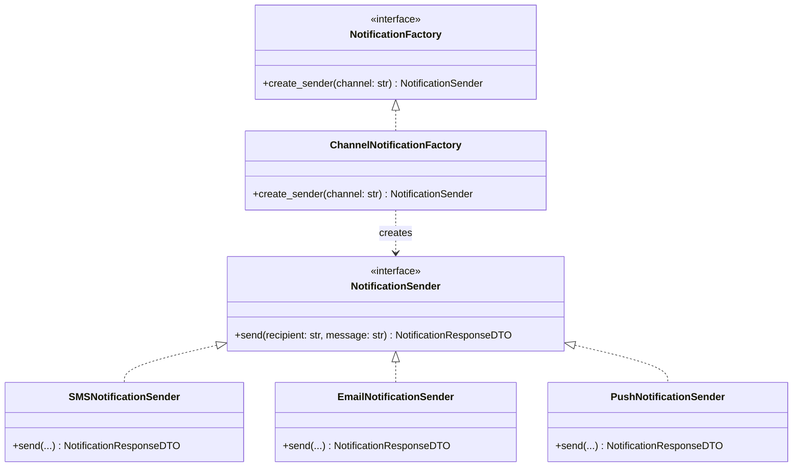
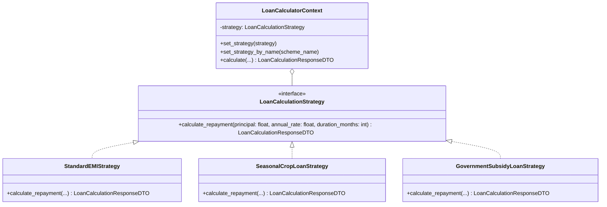
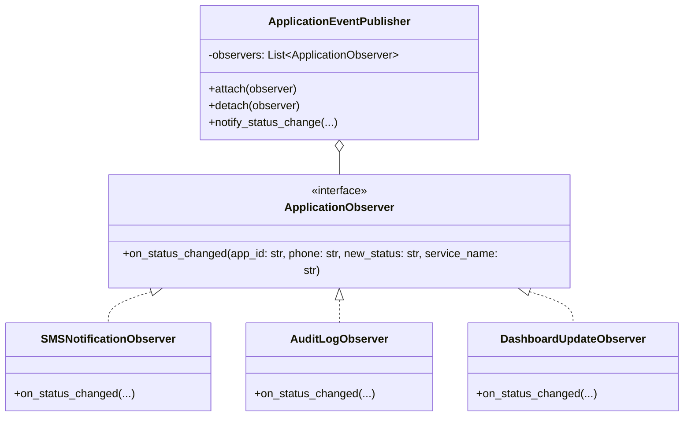
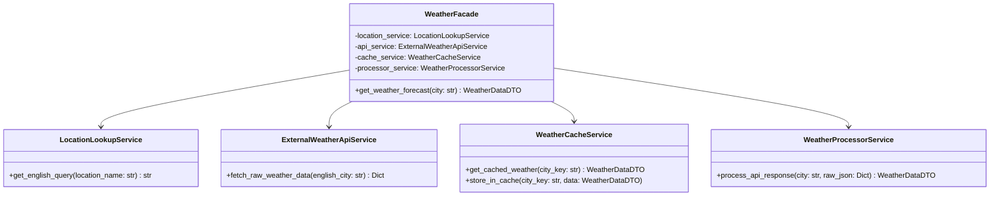

# Pollibondhu (পল্লীবন্ধু) — Integrated Citizen & Rural Agro-Service Platform

Pollibondhu is an integrated digital government and agricultural service web application designed to connect rural citizens, smallholder farmers, and upazila administration officers in Bangladesh with essential public services, agricultural subsidies, market intelligence, digital utility payments, rural transport information, community knowledge sharing, and citizen grievance resolution.

---

## 🏗️ Architecture & Core Design Patterns

The backend implements five core software design patterns in Python / FastAPI:

| # | Design Pattern | Pollibondhu Application Module |
|---|----------------|--------------------------------|
| 1 | **Singleton** | Thread-safe Weather API Client (`WeatherApiClient`) & Configuration Management (`Settings`) |
| 2 | **Factory Method** | Multi-channel Notification Engine (`ChannelNotificationFactory` for SMS, Email, Push) |
| 3 | **Strategy** | Agricultural Loan Repayment & Interest Calculator (`StandardEMIStrategy`, `SeasonalCropLoanStrategy`, `GovernmentSubsidyLoanStrategy`) |
| 4 | **Observer** | Application Lifecycle Events (`ApplicationEventPublisher`, `SMSObserver`, `AuditObserver`, `DashboardObserver`) |
| 5 | **Facade** | Unified Weather Subsystem Orchestration (`WeatherFacade`) |

---

## 🌟 Key Platform Modules & Features

1. **Authentication & User Management**:
   - Role-based access control (`citizen`, `officer`, `admin`).
   - Secure bcrypt password hashing and JWT bearer authentication.
   - NID validation and profile management with live location tracking.

2. **Digital Government & Agricultural Services**:
   - 20+ rural public and agricultural services with document attachments.
   - Dynamic application tracking via application number and citizen phone number.
   - Full audit logging for every lifecycle status transition (`Pending`, `In Progress`, `Approved`, `Rejected`).

3. **Payment & Transaction ID Verification**:
   - Digital payment integration for Bangladesh payment channels: **bKash**, **Nagad**, **Rocket**, and **Bank Payment / Chalan**.
   - Transaction ID ("লেনদেন আইডি / Transaction ID" / "ব্যাংক রেফারেন্স নম্বর / Transaction ID") submission and verification workflows.
   - Multi-status payment tracking: `Submitted`, `Verified`, `Failed`, `Pending`, `Waived`.

4. **Utility & Public Bill Payment Center**:
   - Real-time digital bill payment for:
     - ⚡ পল্লী বিদ্যুৎ বিল (Polli Bidyut Electricity Bill - REB)
     - 💧 কৃষি সেচ ও নলকূপ পানি বিল (BMDA / WASA Irrigation Water)
     - 🔥 এলপিজি ও গ্যাস বিল (LPG & Gas Connection)
     - 🏠 ইউনিয়ন পরিষদ হোল্ডিং ট্যাক্স (Holding Tax)
     - 📜 ইউনিয়ন ট্রেড লাইসেন্স ফি (Trade License Fee)
   - Dynamic user payment history and digital receipts.

5. **Grameen Poribohon (গ্রামীণ পরিবহন)**:
   - Complete route coverage across **all 8 administrative divisions** of Bangladesh (ঢাকা, চট্টগ্রাম, রাজশাহী, খুলনা, বরিশাল, সিলেট, রংপুর, ময়মনসিংহ).
   - Division filtering, schedule lookup, fare estimation, and contact details for local transport operators.

6. **Community Forum & Digital Training**:
   - Interactive citizen forum with real-time **Like ❤️ reactions** and **Comment 💬 feeds**.
   - Verified agricultural video training guides covering biofloc aquaculture, seasonal crops, cattle farming, and digital financial safety.

7. **Krishi Seba & Crop Doctor**:
   - Diagnostic crop disease identification engine with organic and chemical treatment advice.
   - Division-wise daily crop market prices covering paddy, potato, onion, vegetables, and fish.

8. **Officer Dashboard & Grievance Resolution**:
   - Dynamically calculated statistics for assigned applications, complaints, and total resolved files.
   - Application status updates with officer remarks and payment validation.
   - Citizen complaint investigation and resolution pipeline.

---

## ⚡ Quick Start (Single Command)

To launch both the FastAPI backend server and React Vite frontend portal in one command:

```bash
./start.sh
```

- **Frontend Portal**: `http://localhost:3000`
- **Backend API Service**: `http://localhost:8000`
- **Interactive Swagger Docs**: `http://localhost:8000/docs`

---

## 🛠️ Manual Installation & Setup

### Prerequisites
- Python 3.10+
- Node.js 18+ and npm

### 1. Backend Setup
```bash
cd backend
python3 -m venv venv
source venv/bin/activate
pip install -r requirements.txt

# Start FastAPI development server
uvicorn app.main:app --host 127.0.0.1 --port 8000 --reload
```

### 2. Frontend Setup
```bash
cd frontend
npm install
npm run dev
```

### 3. Production Build
```bash
cd frontend
npm run build
```

---

## ⚙️ Environment Variables

Copy `.env.example` to `.env` in the root or `backend/` directory:

```env
# Application Configuration
APP_NAME=Pollibondhu
ENV=development
PORT=8000
HOST=0.0.0.0

# Database Configuration
DATABASE_URL=sqlite:///./pollibondhu.db

# JWT & Authentication Secret
JWT_SECRET_KEY=your_secret_key_here
JWT_ALGORITHM=HS256
ACCESS_TOKEN_EXPIRE_MINUTES=1440

# Weather API
WEATHER_API_BASE_URL=https://api.open-meteo.com/v1/forecast

# CORS Allowed Origins
ALLOWED_ORIGINS=http://localhost:3000,http://127.0.0.1:3000,http://localhost:5173
```

---

## 🧪 Automated Testing

Execute the comprehensive automated test suite across all API routes, design patterns, services, and dynamic dashboard calculations:

```bash
cd backend
pytest -v
```

### Test Coverage & Modules
- **87 Automated Test Cases** covering:
  - `tests/api/test_auth.py` (Authentication, JWT tokens, Role validation)
  - `tests/api/test_citizen.py` (Citizen services, applications, profile updates)
  - `tests/api/test_feature_updates.py` (bKash/Nagad/Rocket/Bank Trx ID, All 8 division transport, Forum reactions & comments)
  - `tests/api/test_utility.py` (Utility bill payments, payment methods, transaction receipts)
  - `tests/api/test_officer.py` & `test_officer_stats_dynamic.py` (Dynamic statistics, application approval, complaint resolution)
  - `tests/design_patterns/*` (Singleton, Factory Method, Strategy, Observer, Facade tests)

---

## 👥 Default Demo Credentials

| Role | Mobile Number | Password | Description |
|------|---------------|----------|-------------|
| **Officer** | `+8801800000000` | `password123` | মোঃ রফিকুল ইসলাম (উপসহকারী কৃষি কর্মকর্তা) |
| **Citizen (Farmer)** | `+8801812345678` | `password123` | আব্দুল কুদ্দুস (ক্ষুদ্র কৃষক) |
| **Admin** | `+8801700000000` | `password123` | সিস্টেম এডমিন (প্রধান কার্যালয়) |


### 5. How It Works
1. When `WeatherApiClient()` is called, Python enters `__new__`.
2. If `_instance` is `None`, it acquires `_lock` (`threading.Lock()`) and performs a double-checked locking check.
3. If still `None`, it creates the single instance and sets `_initialized = False`.
4. Subsequent calls return the existing `_instance` immediately without re-initializing cache dictionaries or connection locks.

### 6. Pollibondhu Use Case
Used in the Weather Advisory module where multiple citizens concurrently check local forecasts. The Singleton ensures that if Farmer A checks weather for "ঢাকা", the response is stored in `WeatherApiClient._cache`, and subsequent requests from Farmer B for "ঢাকা" are served directly from the shared cache hit.

### 7. Benefits
- **Zero Socket Exhaustion**: Reuses a single `httpx.AsyncClient` network pool.
- **Rate Limit Protection**: Prevents redundant external HTTP calls to OpenWeatherMap.
- **Cache Consistency**: Guarantees all request worker threads read from the exact same memory cache.

### 8. Implementation Evidence
- Class: `WeatherApiClient` in `backend/app/services/weather_client.py`
- Methods: `__new__()` with `with cls._lock:` double-checked locking and `__init__()` guard check `getattr(self, '_initialized', False)`.

---

## 2. Factory Method Pattern

### 1. Problem It Solves
Citizens across rural Bangladesh rely on different communication channels (feature phones requiring SMS, formal email for status certificates, or mobile app Push notifications). Hardcoding channel delivery logic inside API controllers creates tight coupling and requires modifying endpoint code whenever a new channel is added.

### 2. Why This Pattern Was Chosen
The Factory Method pattern was chosen because it delegates product creation to a specialized factory class (`ChannelNotificationFactory`). API route handlers depend only on abstract interfaces (`NotificationSender` and `NotificationFactory`), following the Open/Closed Principle.

### 3. Files and Classes

| File | Class | Responsibility |
|------|-------|----------------|
| `backend/app/services/notifications/base.py` | `NotificationSender` | Abstract Product interface declaring the `send()` method contract. |
| `backend/app/services/notifications/sms.py` | `SMSNotificationSender` | Concrete Product 1 handling SMS delivery to telecom gateways. |
| `backend/app/services/notifications/email.py` | `EmailNotificationSender` | Concrete Product 2 handling SMTP email delivery. |
| `backend/app/services/notifications/push.py` | `PushNotificationSender` | Concrete Product 3 handling mobile/web push alerts. |
| `backend/app/services/notifications/factory.py` | `NotificationFactory` | Abstract Creator interface declaring `create_sender()`. |
| `backend/app/services/notifications/factory.py` | `ChannelNotificationFactory` | Concrete Creator instantiating the appropriate `NotificationSender`. |
| `backend/app/api/notifications.py` | `send_notification()` | API route function invoking the factory method. |

### 4. Structure



### 5. How It Works
1. The client passes a channel string (e.g. `"sms"`, `"email"`, `"push"`) to `ChannelNotificationFactory.create_sender()`.
2. The factory method inspects the channel string and instantiates the corresponding concrete class (`SMSNotificationSender()`, `EmailNotificationSender()`, or `PushNotificationSender()`).
3. The client calls `await sender.send(recipient, message)` polymorphically without knowing the concrete class.

### 6. Pollibondhu Use Case
Used in citizen notifications when service application updates or weather alerts are dispatched. The platform dynamically selects SMS for feature phone users and Push notifications for smartphone app users.

### 7. Benefits
- **Decoupled Controllers**: API endpoints do not import concrete notification implementations.
- **Easy Extensibility**: Adding new channels (e.g., WhatsApp, Telephony IVR) requires zero changes to route controllers.
- **Graceful Fallbacks**: Unknown channels automatically default to SMS delivery for rural coverage.

### 8. Implementation Evidence
- Abstract Product: `NotificationSender` in `backend/app/services/notifications/base.py`
- Creator Method: `ChannelNotificationFactory.create_sender()` in `backend/app/services/notifications/factory.py`

---

## 3. Strategy Pattern

### 1. Problem It Solves
Agricultural banking in Bangladesh features diverse loan products (standard monthly compound interest EMI, seasonal crop harvest loans with grace periods, and government-subsidized smallholder loans). Writing monolithic `if-elif-else` calculation logic inside API endpoints makes adding new financial products error-prone and risks corrupting mathematical calculations.

### 2. Why This Pattern Was Chosen
The Strategy pattern was chosen to isolate distinct mathematical formulas into dedicated strategy classes (`StandardEMIStrategy`, `SeasonalCropLoanStrategy`, `GovernmentSubsidyLoanStrategy`). The loan calculation context can switch strategies dynamically at runtime.

### 3. Files and Classes

| File | Class | Responsibility |
|------|-------|----------------|
| `backend/app/services/loans/strategy.py` | `LoanCalculationStrategy` | Abstract Strategy interface declaring `calculate_repayment()`. |
| `backend/app/services/loans/standard_emi.py` | `StandardEMIStrategy` | Concrete Strategy 1 implementing compound interest EMI. |
| `backend/app/services/loans/seasonal_crop.py` | `SeasonalCropLoanStrategy` | Concrete Strategy 2 implementing harvest grace period bullet loans. |
| `backend/app/services/loans/subsidy_loan.py` | `GovernmentSubsidyLoanStrategy` | Concrete Strategy 3 implementing 4% government subsidized interest rates. |
| `backend/app/services/loans/calculator.py` | `LoanCalculatorContext` | Strategy Context class managing active strategy execution. |
| `backend/app/api/loans.py` | `calculate_loan()` | API route function delegating calculation to context. |

### 4. Structure



### 5. How It Works
1. The client sends a request payload specifying `scheme_type` (e.g. `"seasonal_crop"`).
2. `LoanCalculatorContext.set_strategy_by_name()` looks up and instantiates `SeasonalCropLoanStrategy`.
3. The context invokes `self._strategy.calculate_repayment()`, executing the specific financial algorithm.
4. A complete repayment schedule breakdown is returned to the caller.

### 6. Pollibondhu Use Case
Used in the Agricultural Loan Calculator (`AgriLoanFragment`). Farmers applying for Aman/Boro paddy loans select `"seasonal_crop"` to calculate a schedule with a 4-month 0-principal grace period during crop growth, while commercial farmers select `"standard_emi"`.

### 7. Benefits
- **Mathematical Safety**: Each loan interest algorithm is isolated in its own unit-tested class.
- **Runtime Flexibility**: Context switches calculation strategies dynamically.
- **Clean Architecture**: Eliminates long conditional decision trees.

### 8. Implementation Evidence
- Interface: `LoanCalculationStrategy` in `backend/app/services/loans/strategy.py`
- Context Delegation: `LoanCalculatorContext.calculate()` in `backend/app/services/loans/calculator.py`

---

## 4. Observer Pattern

### 1. Problem It Solves
When a citizen's service application (`SERVICE_APPLICATION`) or complaint (`COMPLAINT`) status changes (e.g. `Pending` $\rightarrow$ `Approved`), multiple administrative actions must take place: 1) send an SMS notification to the citizen, 2) write an administrative audit log (`application_status_log`), and 3) broadcast a live update to field officer dashboards. Hardcoding these side-effects inside database status update functions creates tight coupling.

### 2. Why This Pattern Was Chosen
The Observer pattern was chosen to establish a one-to-many dependency between application status subjects and subscriber observers. The core status update workflow remains independent of notification or logging side-effects.

### 3. Files and Classes

| File | Class | Responsibility |
|------|-------|----------------|
| `backend/app/services/events/observer.py` | `ApplicationObserver` | Abstract Observer interface declaring `on_status_changed()`. |
| `backend/app/services/events/publisher.py` | `ApplicationEventPublisher` | Subject / Publisher class managing subscriber list and broadcasting events. |
| `backend/app/services/events/sms_observer.py` | `SMSNotificationObserver` | Concrete Observer 1 sending citizen SMS alerts via Factory Method. |
| `backend/app/services/events/audit_observer.py` | `AuditLogObserver` | Concrete Observer 2 recording government compliance audit logs. |
| `backend/app/services/events/dashboard_observer.py` | `DashboardUpdateObserver` | Concrete Observer 3 pushing live updates to Field Officer dashboards. |
| `backend/app/api/applications.py` | `update_application_status()` | API route function triggering event notifications. |

### 4. Structure



### 5. How It Works
1. Observers (`SMSNotificationObserver`, `AuditLogObserver`, `DashboardUpdateObserver`) are registered with `application_event_publisher.attach()`.
2. When `/api/applications/status` receives an update, it updates the record and calls `await application_event_publisher.notify_status_change()`.
3. The publisher iterates over attached observers and invokes `await observer.on_status_changed()` asynchronously.

### 6. Pollibondhu Use Case
Used in citizen service application workflows (e.g. Fertilizer Subsidy, Agri Loan Approval, Citizen Certificate issuance). Updating an application triggers citizen SMS alerts and government compliance logging automatically.

### 7. Benefits
- **Decoupled Side-Effects**: Database status updates execute independently of external gateway calls.
- **Dynamic Subscriber Management**: Observers can be attached or detached at runtime.
- **Audit Compliance**: Guarantees audit log entries are generated whenever status transitions occur.

### 8. Implementation Evidence
- Interface: `ApplicationObserver` in `backend/app/services/events/observer.py`
- Publisher Broadcast: `ApplicationEventPublisher.notify_status_change()` in `backend/app/services/events/publisher.py`

---

## 5. Facade Pattern

### 1. Problem It Solves
The weather feature involves four distinct internal sub-tasks: 1) location lookup and Bangla-to-English translation, 2) 15-minute TTL cache management, 3) OpenWeatherMap API communication, and 4) raw JSON parsing and Bangla formatting. Forcing API routes or clients to manage these four subsystems directly results in code duplication and tight coupling.

### 2. Why This Pattern Was Chosen
The Facade pattern was chosen to provide a simple, unified interface (`get_weather_forecast`) that encapsulates the interaction between the four weather subsystem classes, presenting a clean interface to FastAPI routes.

### 3. Files and Classes

| File | Class | Responsibility |
|------|-------|----------------|
| `backend/app/services/weather/facade.py` | `WeatherFacade` | Facade class orchestrating all four weather subsystem services. |
| `backend/app/services/weather/location_lookup.py` | `LocationLookupService` | Subsystem 1 translating Bangla division names to English queries. |
| `backend/app/services/weather/external_api.py` | `ExternalWeatherApiService` | Subsystem 2 managing HTTP network requests to OpenWeatherMap API. |
| `backend/app/services/weather/cache_service.py` | `WeatherCacheService` | Subsystem 3 handling memory/database cache storage and 15-minute TTL expiration. |
| `backend/app/services/weather/processor.py` | `WeatherProcessorService` | Subsystem 4 parsing JSON payloads and formatting Bangla DTOs. |
| `backend/app/api/weather.py` | `get_weather()` | API route function consuming `WeatherFacade`. |

### 4. Structure



### 5. How It Works
1. API controller calls `await weather_facade.get_weather_forecast(city)`.
2. `WeatherFacade` calls `LocationLookupService` to translate the city name.
3. `WeatherFacade` checks `WeatherCacheService` for an unexpired cached response.
4. On a cache miss, `WeatherFacade` calls `ExternalWeatherApiService` to fetch raw weather data.
5. `WeatherFacade` passes raw data to `WeatherProcessorService` to build a clean `WeatherDataDTO`.
6. `WeatherFacade` stores the payload in `WeatherCacheService` and returns it to the caller.

### 6. Pollibondhu Use Case
Used in Pollibondhu's Weather Advisory module to deliver local weather forecasts to farmers without exposing network, cache, or parsing logic to the web layer.

### 7. Benefits
- **Simplified API Layer**: API endpoints invoke a single method call.
- **Subsystem Isolation**: Network, caching, parsing, and location services remain independently testable.
- **Centralized Subsystem Flow**: Controls the exact sequence of cache checking, network calls, and data formatting.

### 8. Implementation Evidence
- Facade Class: `WeatherFacade` in `backend/app/services/weather/facade.py`
- Orchestration Method: `WeatherFacade.get_weather_forecast()` in `backend/app/services/weather/facade.py`

---

# Design Pattern Summary

In Pollibondhu, all five software design patterns work together harmoniously to build a clean, maintainable architecture:

1. **Singleton** (`WeatherApiClient` & `Settings`) ensures shared system configuration and connection pools remain unique and thread-safe across request worker threads.
2. **Factory Method** (`ChannelNotificationFactory`) creates the correct product instance (`SMS`, `Email`, `Push`) polymorphically based on citizen communication preferences.
3. **Strategy** (`LoanCalculatorContext`) dynamically selects repayment algorithms (`Standard EMI`, `Seasonal Grace Period`, `Government Subsidy`) for agricultural banking.
4. **Observer** (`ApplicationEventPublisher`) decouples application status updates from side-effects, automatically triggering citizen SMS alerts, audit logs, and dashboard pushes.
5. **Facade** (`WeatherFacade`) simplifies complex multi-service interactions (location lookup, 15-min TTL cache, OpenWeatherMap HTTP requests, JSON parsing) into a single high-level API call.

Together, these five design patterns ensure high cohesion, low coupling, mathematical accuracy, and robust performance for rural digital service delivery.

---

# 🧪 Software Testing

Pollibondhu implements a comprehensive automated test suite in Python using unit testing and API controller integration tests to ensure mathematical precision, thread safety, multi-channel notification decoupling, event broadcasting integrity, and subsystem isolation.

## Testing Framework

The backend testing stack utilizes:
- **`pytest`**: Primary test runner and assertion framework.
- **`pytest-cov`**: Automated line and branch code coverage measurement.
- **`unittest.mock` (`Mock`, `AsyncMock`, `patch`)**: Standard library mocking for isolating unit tests from external HTTP APIs and notification gateways.
- **`FastAPI TestClient`**: In-memory HTTP client for testing FastAPI API routes and controller responses without spawning network sockets.

## Test Organization

```text
backend/tests/
├── conftest.py                             # Shared Pytest fixtures (TestClient, event loop, mock HTTP client)
├── api/                                    # FastAPI route controller tests
│   └── test_routes.py                      # Endpoint integration tests for all 4 pattern routes + root
├── services/                               # Isolated service unit tests
│   └── test_weather_services.py            # Edge case tests for cache TTL and external API errors
└── design_patterns/                        # Design Pattern unit test suite
    ├── test_facade_weather.py              # Subsystem isolation & WeatherFacade orchestration
    ├── test_factory_method.py              # ChannelNotificationFactory product creation & fallback
    ├── test_observer_applications.py       # ApplicationEventPublisher observer attach/detach & dispatch
    ├── test_singleton.py                   # WeatherApiClient & Settings thread-safety & identity
    └── test_strategy_loans.py              # LoanCalculatorContext & loan interest strategy formulas
```

## Unit Testing

The test suite exercises the following Pollibondhu backend components in complete isolation:

- **Singleton Pattern**: Tests `WeatherApiClient` and `Settings` instance identity (`s1 is s2`), double-checked locking thread safety (25 concurrent threads), `_initialized` constructor guard, and shared cache state across instance references.
- **Factory Method Pattern**: Tests `ChannelNotificationFactory.create_sender()` instantiating `SMSNotificationSender`, `EmailNotificationSender`, and `PushNotificationSender` products, unknown channel fallback to SMS, and polymorphic message sending.
- **Strategy Pattern**: Tests mathematical accuracy of `StandardEMIStrategy` ($EMI = \frac{P \cdot r \cdot (1+r)^n}{(1+r)^n - 1}$), `SeasonalCropLoanStrategy` (4-month 0-principal grace period), `GovernmentSubsidyLoanStrategy` (4% rate cap), zero-interest boundary conditions, and dynamic strategy switching in `LoanCalculatorContext`.
- **Observer Pattern**: Tests `ApplicationEventPublisher` observer attachment, detachment, notification dispatch to 1 and multiple observers, empty publisher handling, and concrete observer execution (`SMSNotificationObserver`, `AuditLogObserver`, `DashboardUpdateObserver`).
- **Facade Pattern**: Tests `WeatherFacade` cache hit (bypassing external HTTP calls), cache miss (subsystem orchestration), external API error fallback, `LocationLookupService` Bangla translation, and `WeatherProcessorService` raw JSON parsing.
- **Important Services**: Tests `WeatherCacheService` 15-minute TTL cache expiration and cache clearing, and `ExternalWeatherApiService` 404 HTTP errors and connection timeout handling.
- **Utilities & DTO Schemas**: Tests `Settings` default configuration and Pydantic validation rules in `backend/app/models/domain.py`.
- **API Controllers / Routes**: Tests `GET /api/weather`, `POST /api/notifications/send`, `POST /api/loans/calculate`, `PUT /api/applications/status`, and `GET /` endpoints using `FastAPI TestClient` for HTTP 200 success responses and HTTP 422 validation errors.

## Mocking and Stubbing

External infrastructure dependencies are completely isolated using Python standard library tools to ensure deterministic, network-free test execution:

1. **`AsyncMock` & `patch` for External REST APIs**:
   In `test_facade_weather.py` and `test_singleton.py`, external OpenWeatherMap HTTP network calls are stubbed to return mock JSON payloads or connection errors without touching remote servers:
   ```python
   with patch("httpx.AsyncClient.get", new_callable=AsyncMock) as mock_get:
       mock_get.return_value = mock_response_200
       res = await client.fetch_weather("ঢাকা")
       assert mock_get.call_count == 1
   ```

2. **`patch("builtins.print")` for Notification Gateways**:
   In `test_factory_method.py` and `test_observer_applications.py`, external SMS telecom gateways, SMTP mail servers, and push channels are mocked to capture dispatches without sending real SMS or emails:
   ```python
   with patch("builtins.print") as mock_print:
       response = await sender.send("+8801812345678", "Test Message")
       assert response.success is True
   ```

3. **FastAPI `TestClient` for Controller Isolation**:
   In `test_routes.py`, `TestClient(app)` executes controller functions in-memory, overriding service calls with `AsyncMock` to isolate API endpoint logic from network sockets and database connections:
   ```python
   with patch("app.api.weather.weather_facade.get_weather_forecast", new_callable=AsyncMock) as mock_facade:
       mock_facade.return_value = mock_weather_dto
       response = client.get("/api/weather?city=ঢাকা")
       assert response.status_code == 200
   ```

## Coverage

The latest automated test execution achieved the following line and branch coverage results:

- **Total Test Cases**: **40**
- **Passed Tests**: **40 (100% Pass Rate)**
- **Failed / Skipped**: **0**
- **Line Coverage**: **96%**
- **Branch Coverage**: **50 branch points / 6 partial**
- **Execution Time**: **0.15 seconds**

### Module Coverage Breakdown

| Module / Layer | Statements | Missed | Branch Points | Coverage |
|---|---|---|---|---|
| `app/api/*` (Controllers) | 43 | 0 | 0 | **100%** |
| `app/core/*` & `main.py` | 23 | 0 | 2 | **100%** |
| `app/models/domain.py` (DTOs) | 25 | 0 | 0 | **100%** |
| `app/services/events/*` (Observer) | 43 | 1 | 6 | **98%** |
| `app/services/loans/*` (Strategy) | 85 | 3 | 12 | **96%** |
| `app/services/notifications/*` (Factory Method) | 49 | 2 | 6 | **96%** |
| `app/services/weather/*` (Facade) | 72 | 1 | 12 | **96%** |
| `app/services/weather_client.py` (Singleton) | 47 | 5 | 12 | **86%** |
| **TOTAL BACKEND LOGIC** | **387** | **12** | **50** | **96%** |

## Running Tests

Execute the following exact commands to run the test suite and generate coverage reports:

### 1. Run Complete Test Suite
```bash
cd backend
pytest
```

### 2. Run Test Suite with Terminal Line & Branch Coverage
```bash
cd backend
pytest --cov=app --cov-branch --cov-report=term-missing
```

### 3. Generate HTML Coverage Report
```bash
cd backend
pytest --cov=app --cov-branch --cov-report=html:htmlcov
```
- Open `backend/htmlcov/index.html` in any web browser to view interactive line-by-line coverage visualization.

---

## 🚀 Running Backend & Services

### 1. Running the FastAPI Backend
```bash
cd backend
python3 -m venv venv
source venv/bin/activate
pip install -r requirements.txt
uvicorn app.main:app --reload --port 8000
```
- Interactive API Documentation (Swagger UI): `http://localhost:8000/docs`
